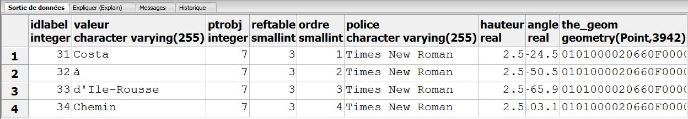

# Modèle Conceptuel de Données du Plan Cadastral (EDIGéO) 

## Signification et observations

NB: le MCD est éditable (format .uxf) avec UMLET (logiciel gratuit).

   Rappel : Le plan cadastral PCI-Vecteur dont sont issues les données EDIGéO est généralement le fruit de la vectorisation 
des plans minutes de conservation (PMC) "papiers" du cadastre dans le cadre de convention entre des collectivités locales
et la DGFiP. Ce cadre conventionnel prévoyait que les services du cadastre étaient chargé de la vérification de la qualité (précision et exhaustivité) de vectorisation
par les sociétés choisies par la collectivité concernée. Ces vérifications portaient essentiellement sur les objets suivants:

Commune
Section
Subsection
Parcelle
Bâtiments

En revanche les objets n'ayant pas une valeur juridique transitive (cf Décret de 1955 sur la publicité foncière) n'ont pas été contrôlés.
Il en résulte que les détails topographiques ne sont pas forcément taggés dans la bonne couche, et que l'ordre des textes n'est pas obligatoirement cohérent.
Exemple : fontaines taggées en pylône ou piscine en trottoire, ou "Le chemin de Bastia à Saint Florent" devient "de Bastia chemin à Saint Florent".
L'intégrateur proposé retranscrit sans le modifier l'état des données EDIGéO du cadastre.

Cette situation illustre aussi le choix d'ETALAB dans la formation de ses fichiers JSON.

### Utilisation de la table label

Nous avons fait le choix d'enregistrer les données texte servant d'habillage au plan et pouvant être composées de plusieurs mots définis par leur position,
orientation, angle, police dans une table "label". Le champs reftable permet de connaître à quelle type d'objet se référe le texte,
exemple reftable=4 le texte se référe à un lieudit. Le champs ptrobj contient l'id de l'objet dans la table concernée, pour notre exemple ce sera la valeur idlieudit.
Le champs ordre (valeur de 1 à 10) permet de recomposer le nom complet.
Exemple : Chemin D'ILE ROUSSE à COSTA
4 Enregistrements dans la table label :

Ici le nom complet fait référence au linéaire de voie de la table zonecommuni qui possède l'id N°7, il illustre aussi les propos du chapitre précédent.

### Les bâtiments

La relation bâtiments parcelle présente dans les fichiers edigéo n'est pas formalisée pour l'instant, mais elle peut être déduite par requête spatiale,
car l'intégrateur respecte les données d'origine, un bâtiment à cheval sur deux parcelles dans la réalité physique sera conformément à PCI-Vecteur composé de deux polygones,
un pour chaque parcelle; ce contrairement aux produits dérivés des données cadastrales (IGN et autre).

### La table tronroute
L'intégrateur étant à l'origine conçu pour des besoins fonciers, la nature de l'objet tronroute nous semble inutile.
En effet une voie privée doit normalement former parcelle.

### Les tables tsurf, tpoint et tline

Ce sont les tables qui contiennent les détails topographiques du plan, surfaciques, ponctuels ou linéaire.
Le champ symbole contient la valeur entière qui correspond au code décrit dans le standard edigéo pci-vecteur fourni par la DGFiP, le lien est disponible sur data.gouv.

Exemple tsurf, code 37 : tunnel

Remarques : l'intégrateur prennat en compte le SCD dans les lots EDIGéO, si la nature de l'objet (surfacique linéaire ou ponctuelle) change ou si le code change
(comme ce fût pour les ponts) l'intégrateur le prend en compte sanbs préavis, à vous de modifier les requêtes en conséquence.

### A venir

Certaines couches ne sont pas gérées comme les croix, les boulons etc ... cela viendra, il n'y a pas d'urgence pour nous,
le bonjour à nos amis d'Alsace Moselle qui bénéficient de lois et de régimes particuliers. 

