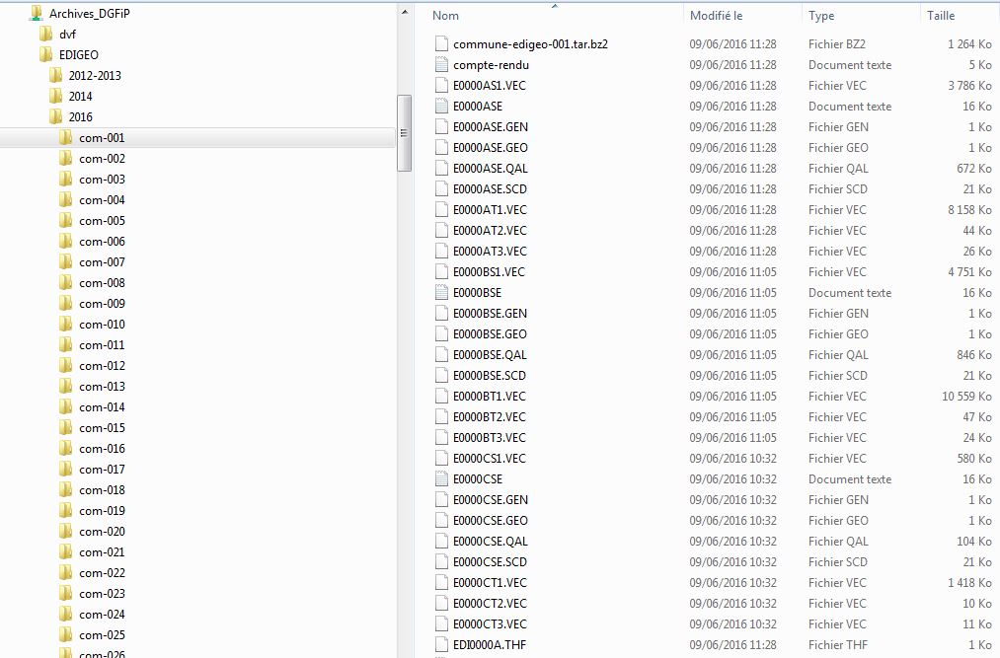
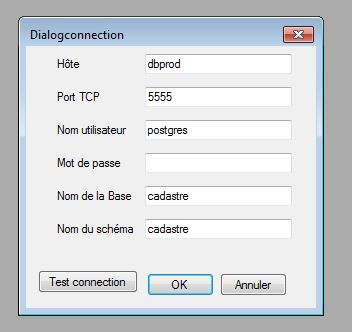
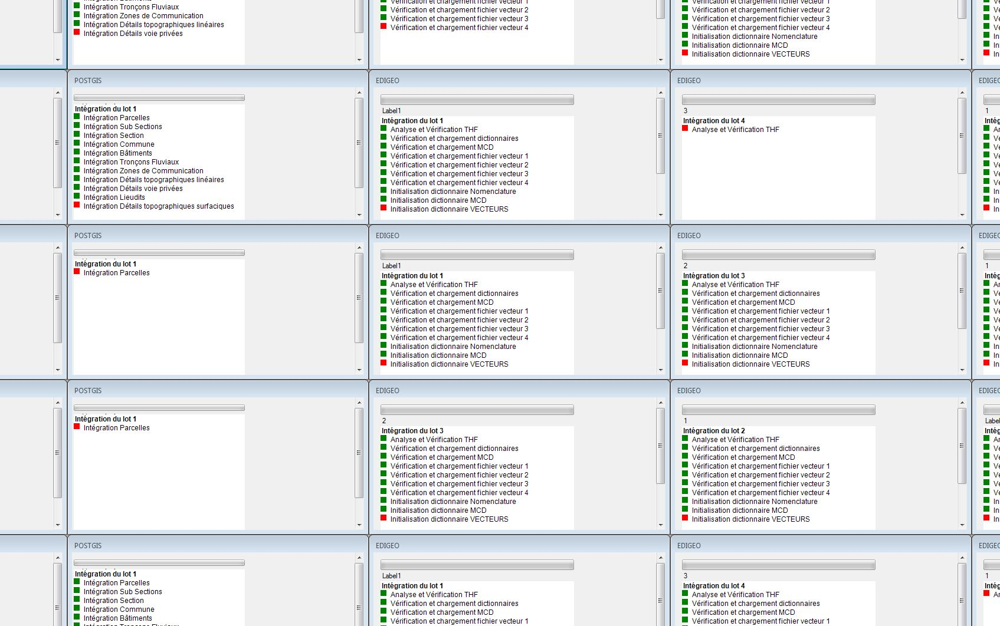

# Utilisation de l’intégrateur 

## Phase 1
Décompressez les fichiers tar.bz2 dans un répertoire, définissez un répertoire principal contenant les sous-répertoires précédemment créés. 

Exemple :

Ici le répertoire principal sera 2016.

## Phase 2

Utilisez le menu fichier -> charger thf

Entrez le millesime de vos données (année ex : 2017) dans la boite de dialogue qui apparaît.

Désignez le répertoire principal.

Dans notre exemple si vous désignez 2016 c'est l'ensemble du répertoire 2016 qui sera intégré, si vous choisissez com-001 seule la commune de code insee 001 sera intégrée. 

Là en fonction du nombre de lots à traiter il se passe un peu de temps, puis une boite de dialogue apparaît.
Vous ne pouvez choisir que l'option "intégration polygonales", les autres options ne sont pas livrées ici.

Ensuite vous pouvez soit :

Régler les options (nous y reviendrons)

Lancer l'intégration depuis le menu fichier -> intégration

La boite de conexion à postgresql/postgis apparaît.

Si la base de données n'existe pas elle sera créée, les données seront intégrées dans le schéma choisi (créé s'il n'existe pas).
L'absence de nom de schéma n'autorise pas l'intégration dans le schéma "public" par défaut.
Un ensemble de fenêtre et une boite de dialogue s'ouvrent ensuite.
Après validation l'intégration commence.

  

Laissez le programme s'éxecuter jusqu'à l'apparition d'une boite de dialogue "Intégration terminée".
Si vous quittez le programme avant cela, l'application crash (bugg non fixé) et l'état de la base de données n'est pas garanti.

 

 
